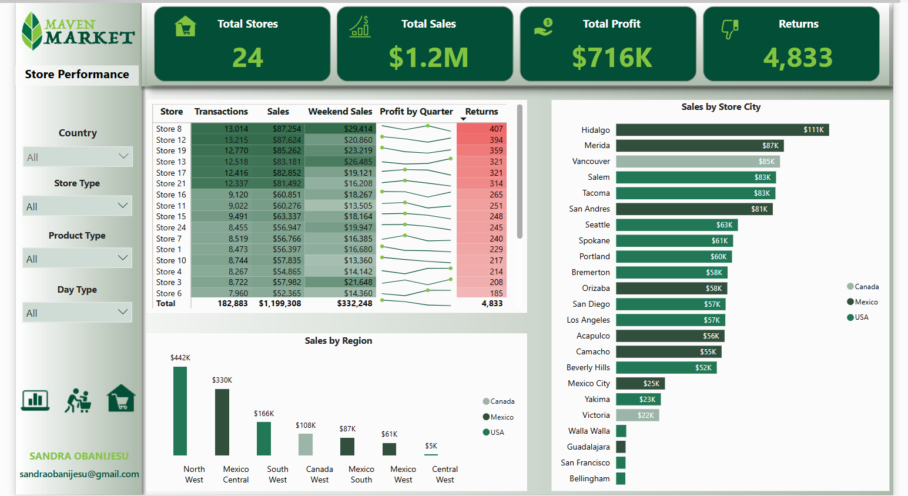

# Maven-Market-Analytics
## Project Goal
The Maven Market project is a detailed sales analysis focused on the performance of Maven Market’s grocery business in 1998. The primary goal is to examine top-level metrics on product brand performance, customer behavior patterns, and store performance across all countries where Maven Market operates. This analysis provides insights into key trends and helps identify areas for growth and improvement across different regions.

# Table Of Contents
* Installation
* About the Project
* The Data Set
* The Data Cleaning
* The Data Model
* Insights
* The Project Limitation
* Recommendation

# Installation 
The project requires:
* `Power BI` for extracting, transforming, and loading (ETL) data, as well as for data cleaning, visualization, and storytelling.

# About The Project 
Maven Market is a multinational grocery chain operating 24 stores across three countries: 13 in the USA, 9 in Mexico, and 2 in Canada. This project delivers an in-depth analysis of sales, customer behavior, and store performance for a multinational grocery chain operating 24 stores across the USA (13), Mexico (9), and Canada (2). This project focuses on analyzing data from 1998 to uncover key insights into financial performance, customer behavior, and store operations across regions. The interactive dashboard provides actionable insights to support data-driven decision-making, offering a detailed view of sales trends, customer preferences, and store performance across all regions.

# The Data Set 
The dataset used in this project was sourced from Maven Analytics, provided in raw form as CSV files. I applied ETL (Extract, Transform, Load) processes, utilizing tools like Power BI to efficiently clean, transform, and load the data. This preparation ensured the dataset was ready for analysis and visualization, allowing for smooth, accurate insights into Maven Market’s 1998 sales performance across multiple regions. 

# The Data Cleaning

The data cleaning process included the following steps:
* Header Promotion: Ensured that the first row of data is used as the header for better clarity.
* Data Type Formatting: Adjusted data types to ensure accurate analysis and compatibility with Power BI.
* Calculated Columns: Added new calculated fields to facilitate deeper insights.
* Null Value Replacement: Addressed missing data by replacing null values appropriately.
* Column Merging and Extraction: Combined and extracted relevant columns to streamline the dataset.
* Folder Data Import: Employed the "Folder" option to append multiple related datasets efficiently.
* Data Trimming: Removed unnecessary whitespace from the dataset for cleaner data presentation.
* Standardization: Standardized column names, date formats, and currency to maintain consistency throughout the dataset.
* Data Profiling: Conducted data profiling to ensure quality assurance and identify any data anomalies on the entire dataset.
* Removal of Unwanted Columns and Duplicates: Cleared out irrelevant columns and eliminated duplicate entries to refine the dataset.

# The Data Model

I established a downward flow data model to ensure a seamless connection between the fact tables and dimension tables. For this model, I employed a Star Schema for all tables, while a Snowflake Schema was utilized for the Stores and Regions tables. The relationships between the tables were established based on the primary and foreign keys, adopting a one-to-many cardinality with a single cross-filter direction. Additionally,  I designated the primary key in each table as the key column and hid all foreign keys to streamline the model and enhance clarity.

# Insights
After thoroughly analyzing the Maven Market dataset and performing data cleaning, I uncovered several key insights:
## Topline Performance

The Key Performance Indicators (KPIs) for the current month reveal a 5.60% increase in sales and a 5.61% rise in profit compared to the previous month. Total current month sales amounted to $120,161, with a profit of $71,682 generated from 18,325 transactions. Notably, sales exceeded the monthly target of $119,500. However, product returns were 2.90% higher than the previous month, highlighting potential concerns with customer satisfaction or product quality.
For the year 1998, Maven Market achieved total sales of $1,199,308, generating a profit of $715,693 with a robust profit margin of 59.68%. Weekly performance peaked in the 50th week of 1998, with sales hitting $44,860. This surge may be attributed to increased orders in preparation for the Christmas season.
In the year, the Hermanos brand achieved the highest sales value at $37,093, with a profit margin of 58.64%. The ADJ brand stood out with an exceptional profit margin of 68.84%, while the Genteel brand experienced the highest return rate at 1.84%. Among products, Mom's Roasted Chicken emerged as the top-seller with 157 units sold, whereas Monarch Rice Medley had the highest number of returns, totaling 11 units.
Among the three countries, Mexico emerged as the top performer for the current month, with a 30% increase in sales, profit, and transaction KPIs. 
A store in Guadalajara, Mexico excelled with over a 65% improvement in monthly performance and a zero return rate. Conversely, a Store in Vancouver, Canada, struggled to meet monthly targets, except in return KPIs, where it showed a reduction in return rates. 
In the current month, low-fat products outperformed high-fat products, with a 7.16% increase in sales, profit, and transactions compared to 4.8% for high-fat products. Returns for low-fat products decreased by 0.92%, suggesting a consumer shift towards healthier choices. Recyclable products saw an 8.26% rise across key KPIs, while non-recyclable products experienced a 5.87% increase, underscoring consumer preference for sustainable goods.

## Customer Behavior

An analysis of Maven Market's customer base highlights intriguing patterns influenced by income levels, education, and purchasing preferences. Of the 10,281 customers recorded, 1,439 had yet to make a purchase.
The Great Pumpernickel Bread led in total sales, generating $1,743 across all locations, while Booker Strawberry Yogurt achieved the highest profit of $1,073 among all products. Gender-specific trends revealed that female customers favored Carrington Turkey TV Dinner Frozen, contributing $983 in sales, whereas male customers frequently purchased Mom’s Roasted Chicken. However, the highest sales among male customers came from Good White Zinfandel Wine, with $989 in revenue.
The analysis identified an inverse relationship between income levels and total sales contributions. Customers earning between $10,000 and $50,000, a lower income bracket contributed significantly to the Maven Market's revenue, while higher-income earners, despite their purchasing power, accounted for the smallest share of sales. 
Educational background also emerged as a critical factor influencing purchasing behavior. The top contributors were customers with high school degrees, bachelor’s degrees, and partial high school education. This data underscores that Maven Market's core audience comprises individuals from accessible education brackets, suggesting that its pricing and product range resonate more with customers prioritizing affordability and familiarity.
These insights provide a valuable perspective on customer behavior, revealing opportunities to tailor marketing strategies and refine product offerings. By leveraging this data, Maven Market can align its promotional activities and inventory with the needs and preferences of these key segments, further solidifying its market position and customer loyalty.

## Store Performance

Maven Market operates a total of 24 stores, distributed across 13 cities in the USA, 9 in Mexico, and 2 in Canada. Among these, the 13 stores in USA generated the highest sales, totaling $612,718 with a profit of $366,000. The 9 stores in Mexico followed closely, contributing $478,916 in sales and $286,000 in profits, while the 2 stores in Canada generated $107,674 in sales and a profit of $64,000.
Store 12 in Hidalgo, Mexico, achieved the highest sales of $87,624 and a profit of $52,000. When combining the sales of both stores in Hidalgo (Store 12 and Store 18), the total sales reached $111,000 for the year. On the other hand, Store 8 reported the highest return of 407 units for the year.
Maven Market operates a total of 5 store types. Among these, the Deluxe Supermarket store type, consisting of 6 stores, led with total sales of $507,664 and a profit of $303,000. This was followed by the Supermarket store type, which includes 8 stores and generated $470,391 in sales and $281,000 in profits. In contrast, the Small Grocery store type, comprising 4 stores, recorded the lowest sales at $19,818 and a profit of $12,000, but notably maintained a zero-return rate, indicating exceptional customer satisfaction and inventory management.
The Northwest region was the top-performing region overall, contributing $441,756 in total sales, highlighting its crucial role in Maven Market’s financial performance.
Regarding product performance, high-fat products generated approximately $466,000 in profit, while low-fat products produced $250,000. Additionally, Store 8 in Merida, Mexico, demonstrated strong weekend sales, achieving $29,414 in sales over weekends.

# Limitations
A significant limitation of this analysis is the absence of industry benchmarks, which restricts the ability to compare Maven Market's performance against broader market trends. As a result, while the insights highlight internal strengths and opportunities, they do not provide a context for competitive positioning.

# Recommendations
Maven Market should focus on the following areas to optimize its performance:
* Increase Customer Retention: While sales are up by 5.6%, the higher return rate (2.9%) suggests room for improvement in product quality and customer satisfaction. Maven Market should focus on improving the quality of products with higher return rates, to minimize returns and increase customer loyalty.
* Onboarding Campaigns and Incentives for First Purchases:
Create welcoming campaigns with introductory discounts or promotional offers tailored for first-time customers. Additionally, provide free trials, small product samples, or targeted discounts specifically aimed at inactive customers. These initiatives will encourage initial purchases and help convert inactive customers into loyal buyers.
* Optimize Marketing Efforts: With lower-income customers driving a significant share of the revenue, Maven Market should focus on affordability in marketing campaigns and product offerings, tailoring them to meet the needs of customers in the $10,000 to $50,000 income bracket.
* Leverage Strong Sales in Mexico: Mexico's 30% growth in sales and profit should be analyzed and leveraged by replicating successful strategies from Mexico across other regions, particularly the USA and Canada.
* Implement Targeted Strategies for Store Types: Given that the Small Grocery store type has zero returns but low sales, Maven Market should assess ways to increase sales while maintaining its high customer satisfaction rate. For the Deluxe Supermarket type, efforts should focus on replicating its success in other stores to further improve sales and profit.
* Focus on Weekend Sales: Store 8 in Merida's performance on weekends should be analyzed to develop targeted weekend promotions or sales strategies across all stores, particularly in regions with underperforming sales.

# Licensing And Authors
This code was created by Sandra Obanijesu under the GPL-3.0 license. Please feel free to use the resources as you deem fit.
